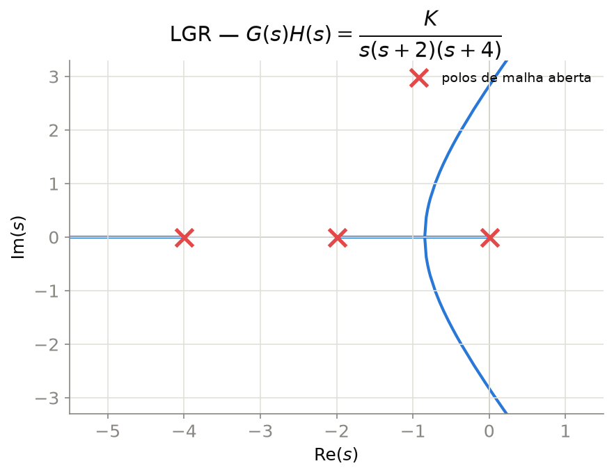
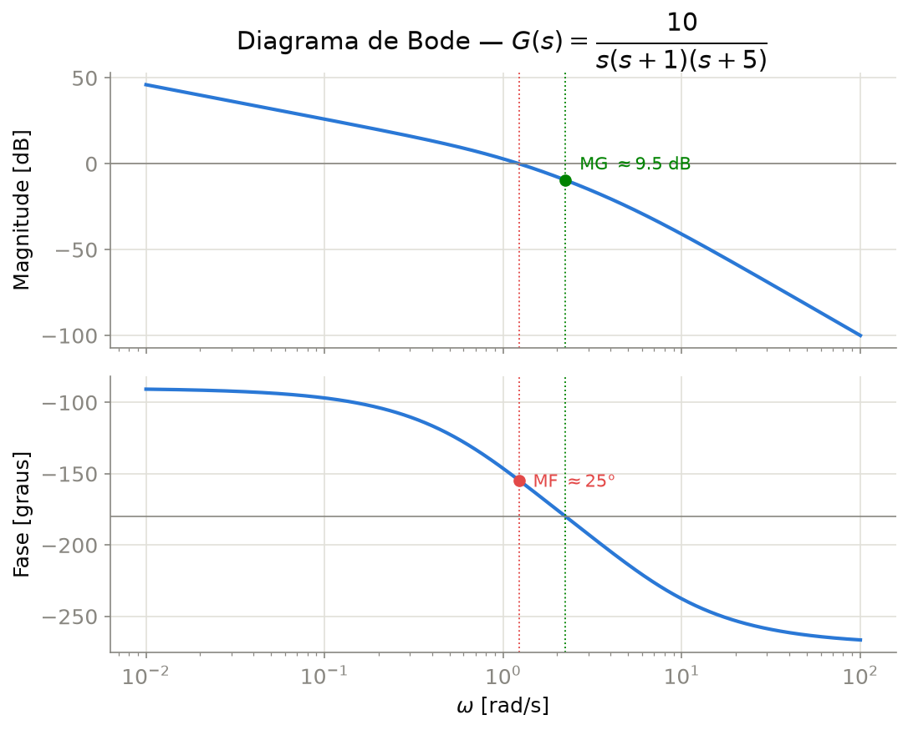
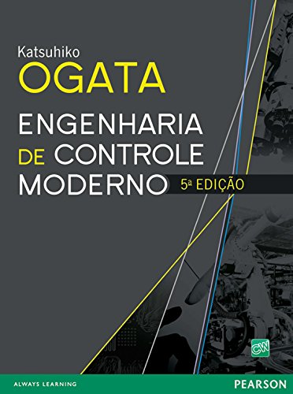
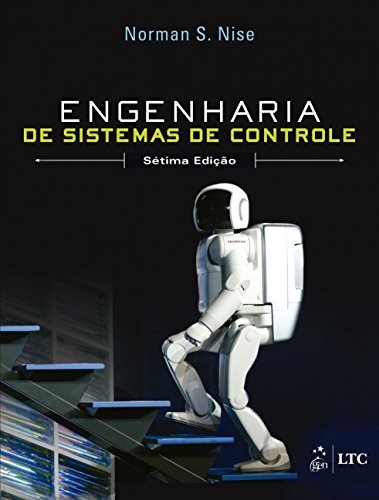
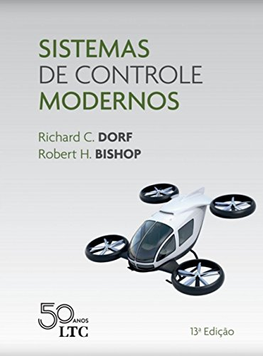
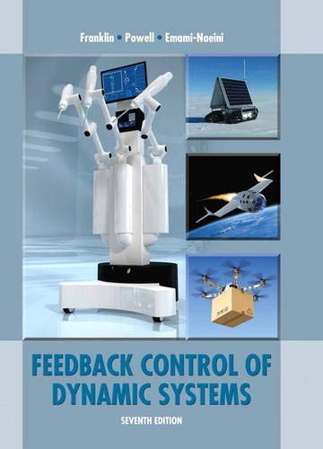

## Identificação

::: {.columns}
::: {.column width="50%"}

| | |
|:--|:--|
| **Curso** | Engenharia Elétrica |
| **Disciplina** | Sistemas de Controle I |
| **Carga horária** | 60 horas |
| **Regime** | Paralelo |
| **Período de oferta** | 31/08/2026 a 19/12/2026 |
| **Encontros** | segundas e sextas-feiras, 14h–15h40 |
| **Período letivo** | 2026.4 |
| **Pré-requisito** | Análise de Sistemas Lineares|

:::
::: {.column width="50%"}

```{tikz}
%| echo: false
%| fig-align: center
%| fig-width: 10
\usetikzlibrary{arrows.meta, positioning, calc}
\input{imgs/tikz/MalhaControleClassica.tikz}
```
Prof. Dr. Raphael Teixeira

raphaelbt@ufpa.br

:::
:::

---

## Ementa

::: {.columns}
::: {.column width="52%"}

1. Introdução: malha aberta e malha fechada
2. Modelagem matemática e função de transferência
3. Diagrama de blocos e álgebra de blocos
4. Resposta transitória de 1ª e 2ª ordem
5. Resposta de ordem superior; polos dominantes

:::
::: {.column width="48%"}

6. Erro de regime permanente e tipo de sistema
7. Critério de estabilidade de Routh-Hurwitz
8. Lugar geométrico das raízes (LGR)
9. Resposta em frequência: Bode, margens de ganho e fase
10. Controladores PID: ação P, I, D; sintonia

:::
:::

::: {.callout-note}
Domínio do tempo contínuo, com a **função de transferência** como modelo central.
:::

---

## Objetivo Geral

::: {style="text-align: justify;"}
Capacitar para modelagem, análise e projeto de sistemas de controle linear, no domínio do tempo, no plano $s$ e na frequência, com ênfase em controladores PID.
:::

::: {.fragment}
::: {.callout-tip title="**Tempo** (transitório, regime), **plano $s$** (Routh-Hurwitz, LGR), **frequência** (Bode) — convergindo no PID"}

::: {.columns}
::: {.column width="50%"}
{width="80%" fig-align="center"}
:::
::: {.column width="50%"}
{width="80%" fig-align="center"}
:::
:::
:::
:::

---

## Objetivos Específicos — Modelagem e Resposta Transitória

::: {.columns}
::: {.column width="58%"}

- Terminologia e estrutura: malha aberta e malha fechada
- Modelagem de sistemas dinâmicos por função de transferência
- Redução de diagramas de blocos por álgebra de blocos
- Resposta transitória de 1ª/2ª ordem pela localização dos polos; extensão a ordem superior via polos dominantes

:::
::: {.column width="42%"}
{width="100%" fig-align="center"}
:::
:::

---

## Objetivos Específicos — Estabilidade, Frequência e PID

::: {.columns}
::: {.column width="58%"}

- Erro de regime permanente e tipo de sistema
- Routh-Hurwitz e LGR para análise e projeto
- Diagramas de Bode; margens de ganho e de fase
- Projeto e sintonia de PID para especificações de desempenho

:::
::: {.column width="42%"}
{width="100%" fig-align="center"}
:::
:::

---

## Competências e Habilidades

- Modelar sistemas LIT por função de transferência e por diagrama de blocos
- Resposta transitória e erro de regime permanente
- Routh-Hurwitz na análise de estabilidade
- LGR no projeto de controladores
- Resposta em frequência (Bode) e margens de estabilidade
- Projeto e sintonia de PID

::: {.callout-important}
Alinhadas à seção 3.4 do PPC de Engenharia Elétrica (2012).
:::

---

## Conteúdo Programático — Visão Geral

```{tikz}
%| echo: false
%| fig-align: center
%| fig-width: 17
\usetikzlibrary{arrows.meta, positioning}
\input{imgs/tikz/UnidadesCurso.tikz}
```

::: {.callout-note}
Seis unidades, em ordem crescente de abstração: do **tempo** (U1–U3) ao **plano $s$ e à frequência** (U4–U5), culminando no **projeto de controladores** (U6).
:::

---

## Procedimentos Metodológicos

- Aulas **expositivas e dialogadas**, com apoio de recursos audiovisuais
- **Simulações computacionais** (MATLAB/Simulink, Python)
- Resolução de **listas de exercícios**
- Discussão orientada de **estudos de caso** aplicados
- **Projeto de controle em sistema real**, desenvolvido em dupla

::: {.callout-note}
**Ferramentas:** MATLAB/Simulink e Python (`python-control`) para simulação dos conceitos.
:::


---

## Simulação Computacional

- Softwares de simulação: MATLAB/Simulink, Python (`python-control`)

::: {style="display:flex; gap:2.5em; justify-content:center; align-items:center; margin-top:1.5em;"}
{style="height:150px; width:auto;"}
{style="height:150px; width:auto;"}
:::

- Recursos de vídeo, com tópicos de modelagem, análise e projeto de sistemas de controle, soluções de exercícios e implementações computacionais.

---

## Avaliação

Avaliação: **prova escrita** e **projeto de controle em sistema real**.

$$\mathrm{NF} = \dfrac{A_1 + A_2}{2} + P_{proj}$$

- $A_1$ — Prova Bimestral
- $A_2$ — Prova Final
- $P_{proj}$ — pontuação da atividade complementar (projeto de controle em sistema real), até **2,0 pontos**

::: {.fragment}
::: {.callout-important}
Aprovação: frequência mínima de **75%** da carga horária e $\mathrm{NF} \geq 5{,}0$ ([Regulamento de Graduação da UFPA](https://proeg.ufpa.br/images/Artigos/Academico/Downloads/Regulamento_de_Graduacao.pdf)).
:::
:::

::: {.fragment}
Avaliações escritas: **no máximo duas** por período, nas semanas de provas do calendário acadêmico (Colegiado da FEE).
:::

---

## Projeto de Controle em Sistema Real

Trabalho em **dupla**, valendo até **2,0 pontos**, somados à média das avaliações ($P_{proj}$).

::: {.columns}
::: {.column width="50%"}
1. Modelagem/identificação do sistema
2. Análise e especificação de desempenho
3. Projeto de controlador por LGR
4. Projeto de controlador por resposta em frequência
:::
::: {.column width="50%"}
5. Simulação computacional
6. Implementação do controlador no sistema real
7. Redação de artigo
8. Apresentação dos resultados
:::
:::

::: {.callout-note}
As oito etapas são **obrigatórias** e percorrem todo o ciclo de projeto: do modelo à validação experimental.
:::

---

## Bibliografia Básica

::: {.columns}
::: {.column width="50%"}
{style="height:480px; width:auto;" fig-align="center"}
:::
::: {.column width="50%"}
{style="height:480px; width:auto;" fig-align="center"}
:::
:::

::: {.columns}
::: {.column width="50%"}
**Ogata, K.** — *Engenharia de Controle Moderno*. 5ª ed. Pearson Prentice Hall, 2010 [@ogata2010]
:::
::: {.column width="50%"}
**Nise, N. S.** — *Engenharia de Sistemas de Controle*. 7ª ed. LTC, 2017 [@nise2015]
:::
:::

---

## Bibliografia Complementar

::: {.columns}
::: {.column width="50%"}
{style="height:480px; width:auto;" fig-align="center"}
:::
::: {.column width="50%"}
{style="height:480px; width:auto;" fig-align="center"}
:::
:::

::: {.columns}
::: {.column width="50%"}
**Dorf, R. C. & Bishop, R. H.** — *Sistemas de Controle Moderno*. 13ª ed. LTC, 2018 [@dorf2018]
:::
::: {.column width="50%"}
**Franklin, G. F. et al.** — *Sistemas de Controle para Engenharia*. 6ª ed. Bookman, 2013 [@franklin2013]
:::
:::

---

## Cronograma — Bloco 1 (Unidades 1–3)

| Aula | Data | Conteúdo |
|:--:|:--:|:--|
| 01 | 31/08 (seg) | Apresentação da disciplina e metodologia. U1 — conceito de controle automático; componentes do sistema |
| 02 | 04/09 (sex) | U1 — malha aberta e malha fechada; realimentação negativa; objetivos de projeto |
| — | 07/09 (seg) | *Feriado — Independência do Brasil* |
| 03 | 11/09 (sex) | U2 — revisão da Transformada de Laplace; função de transferência, polos e zeros |
| 04 | 14/09 (seg) | U2 — modelagem de sistemas mecânicos e eletromecânicos (motor CC) |
| 05 | 18/09 (sex) | U2 — diagrama de blocos; álgebra de blocos (série, paralelo, realimentação) |
| 06 | 21/09 (seg) | U2 — redução de diagramas com múltiplas malhas; lista de exercícios |
| 07 | 25/09 (sex) | U3 — sistemas de 1ª ordem: constante de tempo, degrau, rampa e impulso |
| 08 | 28/09 (seg) | U3 — sistemas de 2ª ordem: frequência natural, amortecimento, classificação |
| 09 | 02/10 (sex) | U3 — especificações de desempenho; ordem superior: polos dominantes |
| 10 | 05/10 (seg) | U3 — **Prova Bimestral (A1)** |
---

## Cronograma — Bloco 2 (Avaliação 1 · Unidades 4–5)

| Aula | Data | Conteúdo |
|:--:|:--:|:--|
| 11 | 09/10 (sex) | Revisão geral para a Prova Bimestral |
| — | 12/10 (seg) | *Feriado — Nossa Senhora Aparecida* |
| 13 | 19/10 (seg) | U4 — estabilidade BIBO; critério de Routh-Hurwitz |
| 13 | 19/10 (seg) | U4 — estabilidade BIBO; critério de Routh-Hurwitz |
| 14 | 23/10 (sex) | U4 — casos especiais do array de Routh; lista de exercícios |
| 15 | 26/10 (seg) | U4 — condições de ângulo e de módulo; construção do LGR |
| 16 | 30/10 (sex) | U4 — assíntotas, pontos de quebra, ângulos de partida/chegada |
| — | 02/11 (seg) | *Feriado — Finados* |
| 17 | 06/11 (sex) | U4 — cruzamento do eixo imaginário; projeto de ganho por LGR |
| 18 | 09/11 (seg) | U5 — resposta em frequência: diagrama de Bode (assíntotas, fatores básicos) |

---

## Cronograma — Bloco 3 (Unidade 6 · Avaliação 2)

| Aula | Data | Conteúdo |
|:--:|:--:|:--|
| 19 | 13/11 (sex) | U5 — margens de ganho e de fase; relação com o amortecimento |
| 20 | 16/11 (seg) | U5 — noção do critério de Nyquist; lista de exercícios |
| — | 20/11 (sex) | *Feriado — Consciência Negra* |
| 21 | 23/11 (seg) | U6 — ação P, I e D; estruturas PI, PD e PID |
| 22 | 27/11 (sex) | U6 — sintonia de Ziegler-Nichols; windup integral, ruído na ação derivativa; lista de exercícios |
| 23 | 30/11 (seg) | Lista de exercícios geral (U4–U6) |
| 24 | 04/12 (sex) | Atendimento a dúvidas e resolução de exercícios |
| 25 | 07/12 (seg) | **Prova Final (A2)** |
| 26 | 11/12 (sex) | Encerramento do conteúdo |
| 27 | 14/12 (seg) | Entrega de Projetos |
| 28 | 18/12 (sex) | Devolutiva de resultados e encerramento do semestre |

---

## Datas-Chave do Semestre

::: {.columns}
::: {.column width="50%"}
**Avaliações**

- 05/10 (sex) — Prova Bimestral (A1)
- 09/12 (seg) — Prova Final (A2)

:::
::: {.column width="50%"}
**Feriados (sem aula)**

- 07/09 — Independência do Brasil
- 12/10 — Nossa Senhora Aparecida
- 02/11 — Finados
- 20/11 — Consciência Negra
:::
:::

::: {.callout-important}
**28 encontros** — 31/08 a 18/12/2026, seg./sex., 14h–15h40.
:::

---

## Referências

::: {style="font-size: 1em;"}
::: {#refs}
:::
:::

<style>
#refs .csl-entry { margin-bottom: 0.6em; }
#refs .csl-entry i { font-weight: bold; }
</style>

---

##

::: {style="text-align:center;"}
{width="200px"}

**Prof. Dr. Raphael Teixeira**

UFPA - CAMTUC - FEE

raphaelbt@ufpa.br
:::
