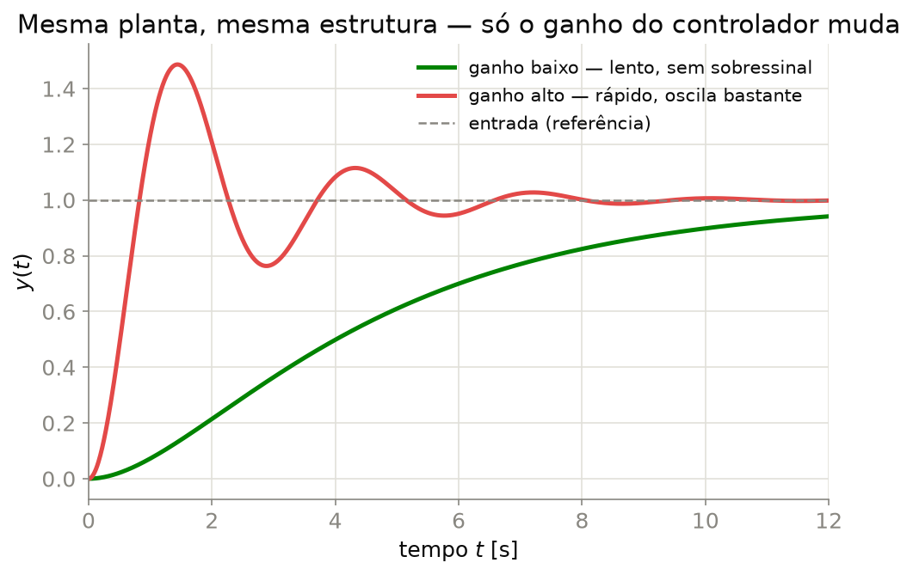

## O que é um Sistema de Controle?

```{tikz}
%| echo: false
%| fig-align: center
%| fig-width: 10
\usetikzlibrary{arrows.meta, positioning}
\input{imgs/tikz/CaixaPreta.tikz}
```

::: {.fragment}
$$y(t) \to r(t)$$
:::

::: {.fragment}
**A saída deve seguir a referência** — mesmo com perturbações e incertezas
:::

---

## Está em Toda Parte

:::{.columns}
::: {.column width="50%"}

- Temperatura (ar-condicionado, forno)
- Velocidade (cruise control, motor)
- Posição (robótica, antena, CNC)

:::
::: {.column width="50%"}

- Nível (tanque, caldeira)
- Tensão (fonte, gerador)
- Rota (piloto automático, drone)

:::
:::

::: {.callout-note}
Até o corpo humano controla: pâncreas $\to$ glicose, olhos $\to$ rastreiam um alvo.
:::

---

## Malha Aberta

```{tikz}
%| echo: false
%| fig-align: center
%| fig-width: 10
\usetikzlibrary{arrows.meta, positioning}
\input{imgs/tikz/MalhaAberta.tikz}
```

- Não mede a saída
- Ação **pré-calculada**, sem correção
- Simples e barato — **sensível** a perturbações

::: {.callout-tip}
Torradeira, máquina de lavar, semáforo de tempo fixo.
:::

---

## Malha Fechada (Realimentação)

```{tikz}
%| echo: false
%| fig-align: center
%| fig-width: 10
\usetikzlibrary{arrows.meta, positioning, calc}
\input{imgs/tikz/MalhaFechada.tikz}
```

- **Mede** a saída e compara com a referência
- Atua sobre o **erro** $e(t) = r(t) - y(t)$
- **Robusto** — corrige perturbações e incertezas

::: {.callout-tip}
Termostato, piloto automático, cruise control.
:::

---

## Aberta vs. Fechada

| | Malha Aberta | Malha Fechada |
|---|:--:|:--:|
| Mede a saída? | Não | Sim |
| Custo | Baixo | Maior |
| Perturbações | Sensível | Robusto |
| Estabilidade | Sempre estável* | Pode instabilizar |

::: {.callout-important}
Realimentação não é grátis: ganha-se robustez, arrisca-se estabilidade.
:::

---

## Ideia Central 1 — Existe um Modelo

```{tikz}
%| echo: false
%| fig-align: center
%| fig-width: 8
\usetikzlibrary{arrows.meta, positioning}
\input{imgs/tikz/ModeloGs.tikz}
```

$$Y(s) = G(s)\,U(s)$$

::: {.fragment}
- Todo sistema físico $\to$ um **modelo matemático**
- Construído com leis físicas (Newton, Kirchhoff…) $+$ Laplace
- Permite **prever** o comportamento sem testar na planta real
:::

::: {.callout-note}
Esse é o assunto da próxima aula.
:::

---

## Ideia Central 2 — Ajustar Parâmetros Muda o Comportamento

{width="62%" fig-align="center" fig-alt="Mesma planta, mesmo controlador — só o ganho muda"}

::: {.fragment}
**Ganho alto** $\to$ rápido, oscila &nbsp;&nbsp;|&nbsp;&nbsp; **Ganho baixo** $\to$ suave, lento
:::

::: {.callout-important}
Projetar controle é escolher os **parâmetros certos** para o comportamento desejado — é isso que faremos o curso inteiro.
:::

---

## Componentes de um Sistema de Controle

:::{.columns}
::: {.column width="45%"}

| Componente | Papel |
|:-----------|:----------|
| Planta | sistema a controlar |
| Atuador | age sobre a planta |
| Sensor | mede a saída |
| Controlador | calcula a ação |

Terminologia de [@nise2015], compatível com [@dorf2018].

:::
::: {.column width="55%"}

```{tikz}
%| echo: false
%| fig-align: center
%| fig-width: 8
\usetikzlibrary{arrows.meta, positioning, calc}
\input{imgs/tikz/ComponentesSistema.tikz}
```

:::
:::

---

## Sinais do Sistema

$$r(t) \quad y(t) \quad e(t) = r(t)-y(t) \quad u(t) \quad d(t) \quad n(t)$$

- $r$ referência &nbsp; $y$ saída &nbsp; $e$ erro &nbsp; $u$ controle
- $d$ perturbação &nbsp; $n$ ruído de medição

::: {.callout-note}
Objetivo: $y(t) \to r(t)$ mesmo com $d(t)$ e incertezas em $G(s)$.
:::

---

## Objetivos de Projeto

1. **Estabilidade** — não pode divergir
2. **Resposta transitória** — velocidade, sobressinal
3. **Erro de regime permanente** — precisão final

::: {.callout-important}
Eles **competem** entre si — você já viu isso no gráfico de ganho alto/baixo.
:::

---

## Um Pouco de História

- **1788** — regulador de Watt (máquinas a vapor)
- **1868** — Maxwell analisa sua estabilidade [@maxwell1868]
- **1927–40** — Black, Nyquist, Bode (Bell Labs) — resposta em frequência
- **1922–42** — Minorsky, Ziegler-Nichols — controlador PID [@ziegler1942]
- **1948** — Evans — Lugar Geométrico das Raízes

::: {.callout-note}
O **controle clássico** (tema deste curso) opera no domínio de $s$.
:::

---

## Roteiro do Curso

| Bloco | Conteúdo |
|:--|:--|
| Modelagem | Laplace, função de transferência, blocos |
| Transitório | 1ª e 2ª ordem, polos dominantes |
| Regime permanente | erro, tipo de sistema |
| Estabilidade | Routh-Hurwitz, LGR |
| Frequência | Bode, margens |
| Controladores | P, PI, PD, PID |

---

## Exercícios

1. Cite três sistemas de controle do seu cotidiano e classifique-os (malha aberta/fechada).
2. Para um chuveiro elétrico com termostato, identifique $r(t)$, $y(t)$, $u(t)$, $e(t)$, $d(t)$.
3. Na Figura de ganho alto/baixo: o que ocorreria se o ganho fosse ainda **maior**? O sistema poderia ficar instável?
4. Pesquise o regulador centrífugo de Watt (1788) e sua importância histórica.

---

## Referências

::: {#refs}
:::
