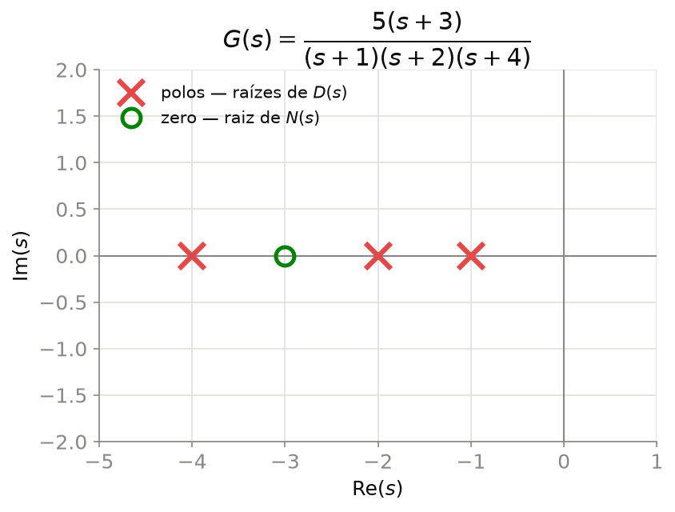

```{r setup, include=FALSE}
# Habilita decorations.pathmorphing (mola/bobina) nos chunks {tikz} desta aula.
knitr::opts_chunk$set(engine.opts = list(
  extra.preamble = c("\\usetikzlibrary{decorations.pathmorphing}")
))
```

## Por que Laplace?

```{tikz}
%| echo: false
%| fig-align: center
%| fig-width: 11
\usetikzlibrary{arrows.meta, positioning}
\input{imgs/tikz/FluxoLaplace.tikz}
```

- EDO $\to$ difícil de manipular e de interligar em blocos
- Laplace: deriva $\to$ **multiplica** por $s$
- Sistema passa a ser descrito por **álgebra**

---

## Transformada de Laplace

$$\mathcal{L}\{f(t)\} = F(s) = \int_0^{\infty} f(t)\,e^{-st}\,dt, \qquad s = \sigma + j\omega \in \mathbb{C}$$

$$\mathcal{L}\left\{\frac{d^n f}{dt^n}\right\} = s^n F(s) \qquad \text{(condições iniciais nulas)}$$

| Propriedade | Expressão |
|:------------|:----------|
| Linearidade | $\mathcal{L}\{\alpha f + \beta g\} = \alpha F(s) + \beta G(s)$ |
| Deslocamento em $s$ | $\mathcal{L}\{e^{-at}f(t)\} = F(s+a)$ |
| Valor final | $\displaystyle\lim_{t\to\infty} f(t) = \lim_{s\to 0} sF(s)$ |
| Valor inicial | $f(0^+) = \displaystyle\lim_{s\to\infty} sF(s)$ |

---

## Pares Notáveis

| $f(t)$, $t \geq 0$ | $F(s)$ |
|:--------------------|:-------|
| $\delta(t)$ impulso | $1$ |
| $u(t)$ degrau | $\dfrac{1}{s}$ |
| $t$ rampa | $\dfrac{1}{s^2}$ |
| $e^{-at}$ | $\dfrac{1}{s+a}$ |
| $\sin(\omega t)$ | $\dfrac{\omega}{s^2+\omega^2}$ |
| $\cos(\omega t)$ | $\dfrac{s}{s^2+\omega^2}$ |

::: {.callout-tip}
Tabelas completas em qualquer livro de sinais e sistemas [@ogata2010; @nise2015].
:::

---

## Função de Transferência

```{tikz}
%| echo: false
%| fig-align: center
%| fig-width: 8
\usetikzlibrary{arrows.meta, positioning}
\input{imgs/tikz/ModeloGs.tikz}
```

::: {.callout-important}
## Definição
$$G(s) = \frac{Y(s)}{U(s)}, \qquad \text{condições iniciais nulas}$$
:::

---

## Exemplo Mínimo

$$\frac{dc}{dt} + 2c(t) = r(t)$$

::: {.fragment}
Laplace (condições iniciais nulas):
$$sC(s) + 2C(s) = R(s)$$
:::

::: {.fragment}
$$\boxed{G(s) = \frac{C(s)}{R(s)} = \frac{1}{s+2}}$$
:::

::: {.callout-note}
Três linhas — é só isso [@nise2015].
:::

---

## Forma Geral

$$G(s) = \frac{b_m s^m + \cdots + b_0}{a_n s^n + \cdots + a_0} = \frac{N(s)}{D(s)}$$

- Raízes de $N(s)$ $\to$ **zeros**
- Raízes de $D(s)$ $\to$ **polos** — equação característica

---

## Zeros e Polos no Plano $s$

{width="52%" fig-align="center" fig-alt="Zeros e polos genéricos de G(s) no plano s"}

::: {.callout-note}
Os polos determinam a resposta natural do sistema — tema das próximas aulas.
:::

---

## Exemplo: Massa-Mola-Amortecedor

```{tikz}
%| echo: false
%| fig-align: center
%| fig-width: 8
\usetikzlibrary{arrows.meta, decorations.pathmorphing}
\input{imgs/tikz/MassaMolaAmortecedor.tikz}
```

$$m\,\ddot{x}(t) + b\,\dot{x}(t) + k\,x(t) = F(t)$$

---

## Massa-Mola-Amortecedor — FT

$$m\,s^2 X(s) + b\,s\,X(s) + k\,X(s) = F(s)$$

$$\boxed{G(s) = \frac{X(s)}{F(s)} = \frac{1}{m s^2 + b s + k}}$$

::: {.callout-tip}
Mesma matemática de um circuito RLC série — domínios físicos diferentes, mesmo modelo.
:::

---

## Exemplo: Motor CC

```{tikz}
%| echo: false
%| fig-align: center
%| fig-width: 11
\usetikzlibrary{arrows.meta, decorations.pathmorphing}
\input{imgs/tikz/MotorCC.tikz}
```

**Armadura:** $v_a = R_a i_a + L_a\dot{i}_a + K_b\omega$  &nbsp;&nbsp; **Eixo:** $J\dot\omega + b\,\omega = K_t i_a$

---

## Motor CC — FT

$$\boxed{\frac{\Omega(s)}{V_a(s)} = \frac{K_t}{(R_a+L_a s)(Js+b) + K_t K_b}}$$

::: {.fragment}
Se $L_a \approx 0$ (indutância desprezível) $\to$ reduz a **1ª ordem**:

$$\frac{\Omega(s)}{V_a(s)} \approx \frac{K}{\tau s + 1}$$
:::

---

## Diagrama de Blocos

- **Blocos** — função de transferência do subsistema
- **Setas** — sentido do sinal (unidirecional)
- **Somadores** — soma/subtrai sinais
- **Pontos de derivação** — mesmo sinal, dois destinos

::: {.callout-tip}
Reduz sistemas interligados a uma única FT equivalente.
:::

---

## Série

```{tikz}
%| echo: false
%| fig-align: center
%| fig-width: 13
\usetikzlibrary{arrows.meta, positioning}
\input{imgs/tikz/SerieBlocos.tikz}
```

$$G_{eq}(s) = G_1(s)\,G_2(s)$$

---

## Paralelo

```{tikz}
%| echo: false
%| fig-align: center
%| fig-width: 13
\usetikzlibrary{arrows.meta, positioning, calc}
\input{imgs/tikz/ParaleloBlocos.tikz}
```

$$G_{eq}(s) = G_1(s) + G_2(s)$$

---

## Realimentação

```{tikz}
%| echo: false
%| fig-align: center
%| fig-width: 13
\usetikzlibrary{arrows.meta, positioning, calc}
\input{imgs/tikz/RealimentacaoBlocos.tikz}
```

$$\boxed{G_{eq}(s) = \frac{G(s)}{1+G(s)H(s)}}$$

::: {.callout-important}
A fórmula mais usada do curso — memorize.
:::

---

## Exemplo: Múltiplas Malhas

```{tikz}
%| echo: false
%| fig-align: center
%| fig-width: 14
\usetikzlibrary{arrows.meta, positioning, calc}
\input{imgs/tikz/ReducaoExemplo.tikz}
```

Reduza **de dentro para fora**: malha interna $\to$ série $\to$ malha externa.

---

## Solução — Passo a Passo

**1. Malha interna** ($G_2$ com $H_1$):
$$G_2'(s) = \frac{G_2(s)}{1+G_2(s)H_1(s)}$$

**2. Série** com $G_1$ e $G_3$:
$$G_{13}'(s) = G_1(s)\,G_2'(s)\,G_3(s)$$

**3. Malha externa** (com $H_2$):
$$\boxed{\frac{Y(s)}{R(s)} = \frac{G_1G_2G_3}{1+G_2H_1+G_1G_2G_3H_2}}$$

---

## Exercícios

1. Obtenha $X(s)/F(s)$ para $m=2\text{ kg}$, $b=4\text{ N·s/m}$, $k=8\text{ N/m}$.
2. Para $R_a=1\,\Omega$, $L_a\approx0$, $J=0{,}02$, $b=0{,}1$, $K_t=K_b=0{,}05$, obtenha $\Omega(s)/V_a(s)$.
3. Reduza $G_1(s)$ e $G_2(s)$ em série, com realimentação unitária negativa em torno do conjunto.
4. $G_1,G_2$ em paralelo, em série com $G_3$, realimentação negativa por $H(s)$. Obtenha $Y(s)/R(s)$.
5. Refaça a redução de múltiplas malhas invertendo a ordem — confirme que o resultado não muda.

---

## Referências

::: {#refs}
:::
