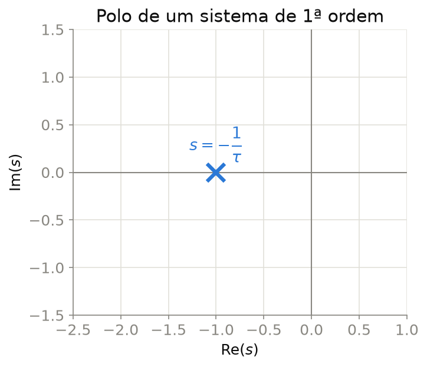
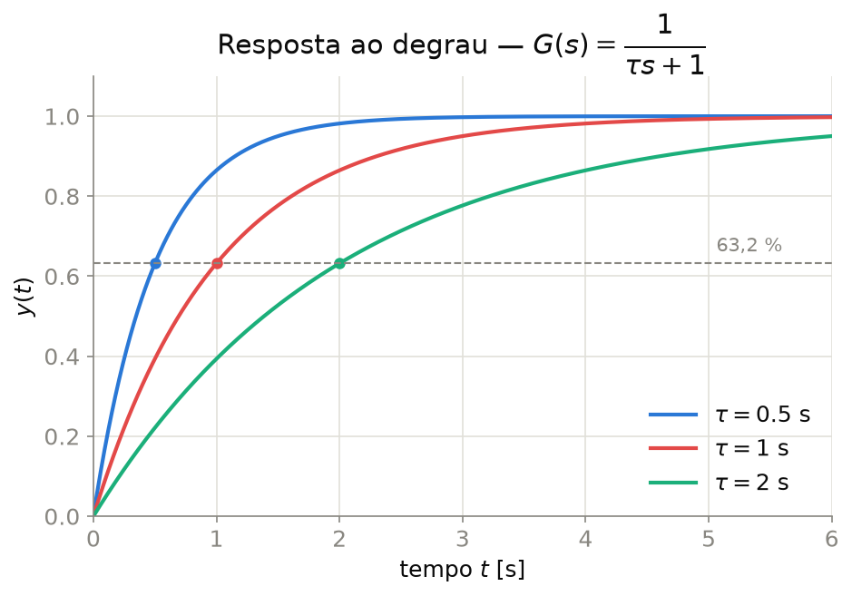

## Sistema de Primeira Ordem — Forma Padrão

Todo sistema de primeira ordem (um único polo real, sem zeros) pode ser escrito na **forma padrão**:

$$\boxed{G(s) = \frac{K}{\tau s + 1} = \frac{K/\tau}{s+1/\tau}}$$

- $K$ — **ganho estático** (ganho DC): $K = G(0)$
- $\tau$ — **constante de tempo** [s]: quanto menor $\tau$, mais rápida a resposta
- **Polo único** em $s = -1/\tau$ (no semiplano esquerdo se $\tau > 0$)

::: {.callout-tip}
Exemplos físicos: circuito RC/RL, sistema térmico de primeira ordem, motor CC desprezando a indutância de armadura (Aula 2), nível de um tanque com escoamento livre.
:::

---

## Polo de um Sistema de Primeira Ordem

{width="45%" fig-align="center"}

Quanto mais **à esquerda** o polo estiver no plano $s$ (maior $1/\tau$, menor $\tau$), **mais rápida** é a resposta do sistema.

---

## Resposta ao Degrau

Para uma entrada degrau unitário $U(s) = 1/s$:

$$Y(s) = G(s)\,U(s) = \frac{K}{\tau s+1}\cdot\frac{1}{s} = \frac{K}{s} - \frac{K\tau}{\tau s + 1}$$

Invertendo por Laplace:

$$\boxed{y(t) = K\left(1 - e^{-t/\tau}\right), \quad t \geq 0}$$

- Resposta **monotônica**, sem oscilação nem sobressinal
- $y(0) = 0$; $y(\infty) = K$ (valor final, pelo teorema do valor final)

---

## Resposta ao Degrau — Gráfico

{width="72%" fig-align="center"}

Quanto **menor** $\tau$, mais rapidamente a resposta se aproxima do valor final $K$ (aqui, $K=1$).

---

## A Constante de Tempo $\tau$

::: {.callout-important}
## Interpretação de $\tau$
Em $t = \tau$, a resposta atinge **63,2%** do valor final:

$$y(\tau) = K(1-e^{-1}) \approx 0{,}632\,K$$
:::

| $t$ | $y(t)/K$ | % do valor final |
|:--:|:--:|:--:|
| $\tau$ | $1-e^{-1}$ | 63,2% |
| $2\tau$ | $1-e^{-2}$ | 86,5% |
| $3\tau$ | $1-e^{-3}$ | 95,0% |
| $4\tau$ | $1-e^{-4}$ | 98,2% |
| $5\tau$ | $1-e^{-5}$ | 99,3% |

::: {.callout-tip}
Regra prática: a resposta é considerada **acomodada** após $4\tau$ a $5\tau$ (critério de 2% ou 1%).
:::

---

## Especificações de Tempo — Primeira Ordem

Para um sistema de primeira ordem em resposta ao degrau, definem-se:

- **Tempo de subida** $t_r$ (10%–90%): $\quad t_r = \tau\,\ln(9) \approx 2{,}2\,\tau$
- **Tempo de acomodação** $t_s$ (critério de 2%): $\quad t_s = 4\,\tau$
- **Tempo de acomodação** $t_s$ (critério de 1%): $\quad t_s = 4{,}6\,\tau$

::: {.callout-note}
Não há **sobressinal** ($M_p = 0$) em um sistema de primeira ordem puro — o sobressinal só aparece em sistemas de ordem 2 ou superior com polos complexos, tema da próxima aula.
:::

---

## Resposta à Rampa e ao Impulso

**Entrada rampa** $u(t) = t \implies U(s) = 1/s^2$:

$$y(t) = K\left(t - \tau + \tau e^{-t/\tau}\right) \;\xrightarrow{t\to\infty}\; K(t-\tau)$$

A saída rastreia a rampa com **erro de regime permanente constante** igual a $K\tau$ (ou $\tau$, se $K=1$) — antecipação do que veremos na Aula 6.

**Entrada impulso** $u(t)=\delta(t) \implies U(s)=1$:

$$y(t) = \frac{K}{\tau}\,e^{-t/\tau}$$

Resposta ao impulso é a **derivada** da resposta ao degrau — propriedade geral de sistemas LIT.

---

## Identificação Experimental de $\tau$ e $K$

Dado um registro experimental da resposta ao degrau de amplitude $A$:

1. $K = \dfrac{y(\infty)}{A}$ (razão entre o valor final e a amplitude do degrau)
2. $\tau$ = tempo para atingir **63,2%** do valor final, **ou**
3. $\tau$ = inverso da inclinação inicial normalizada: $\tau = \dfrac{y(\infty)}{\dot y(0^+)}$

::: {.callout-tip}
Esse procedimento gráfico é a base de métodos de identificação de sistemas usados na prática industrial (ex.: sintonia de malhas de temperatura e vazão).
:::

---

## Exemplo Resolvido

**Problema:** Um sensor de temperatura tem resposta ao degrau que atinge 63,2% do valor final em 3 s e se estabiliza em 20 °C para uma entrada em degrau de 20 °C aplicada em $t=0$.

**Solução:**

- $K = 20/20 = 1$ (ganho unitário — a saída em regime é igual à entrada)
- $\tau = 3$ s (tempo para 63,2%)

$$G(s) = \frac{1}{3s+1}, \qquad y(t) = 20\left(1-e^{-t/3}\right)\ °\text{C}$$

$$t_s \text{ (2\%)} = 4\tau = 12\text{ s}, \qquad t_r = 2{,}2\tau \approx 6{,}6\text{ s}$$

---

## Exercícios

1. Um sistema de primeira ordem tem $\tau = 0{,}5$ s e $K=2$. Escreva $G(s)$, obtenha $y(t)$ para entrada degrau unitário e calcule $t_s$ (2%).
2. Um motor CC (aproximação de 1ª ordem) atinge 63,2% da velocidade final em 0,2 s. Estime $\tau$ e o tempo necessário para atingir 98% da velocidade final.
3. A partir de $y(t) = 5(1-e^{-2t})$, identifique $K$, $\tau$, o polo do sistema e o tempo de subida $t_r$.
4. Mostre, a partir de $Y(s)=G(s)/s$ com $G(s)=K/(\tau s+1)$, os passos de frações parciais que levam a $y(t) = K(1-e^{-t/\tau})$.
5. Explique por que a resposta ao impulso de um sistema de 1ª ordem é proporcional à derivada da resposta ao degrau, usando a propriedade de derivação da Transformada de Laplace.

---

## Referências

::: {#refs}
:::
