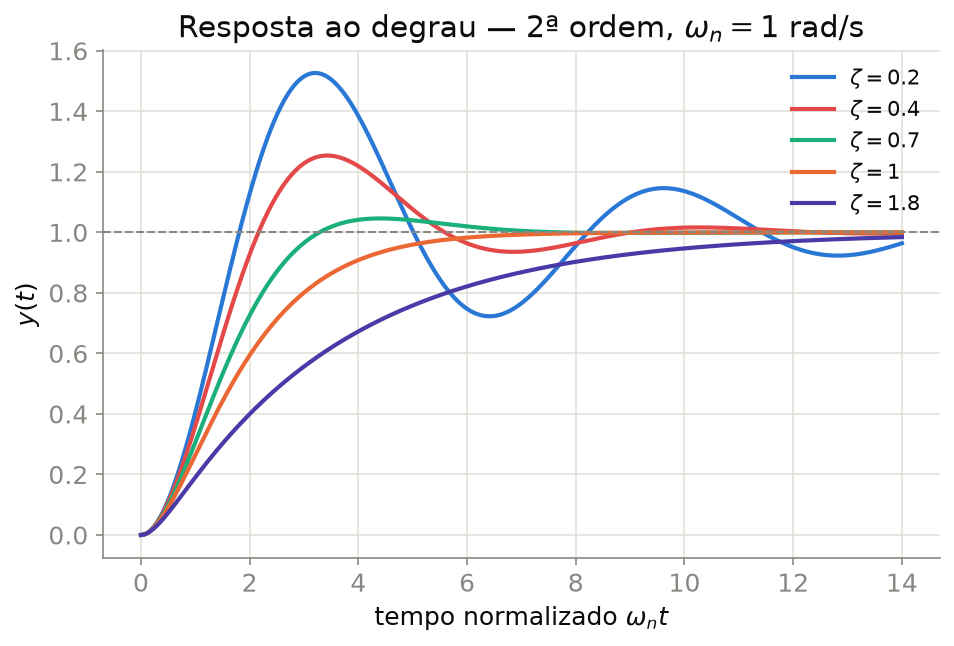
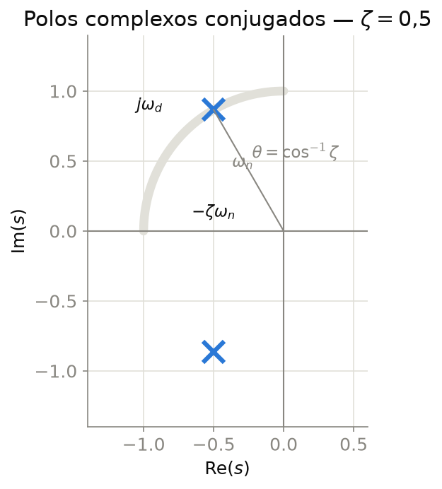
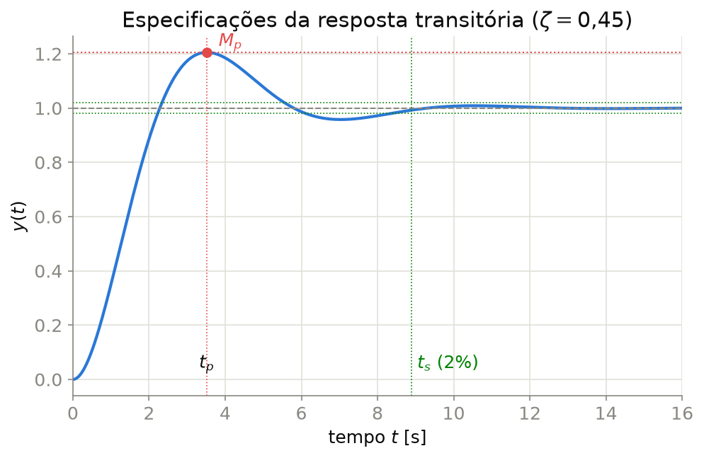

## Sistema de Segunda Ordem — Forma Padrão

Todo sistema de segunda ordem sem zeros pode ser escrito na **forma padrão**:

$$\boxed{G(s) = \frac{\omega_n^2}{s^2 + 2\zeta\omega_n s + \omega_n^2}}$$

- $\omega_n$ — **frequência natural não amortecida** [rad/s]
- $\zeta$ — **coeficiente de amortecimento** (adimensional, $\zeta \geq 0$)
- Ganho estático unitário: $G(0)=1$

**Polos** (raízes de $s^2+2\zeta\omega_n s+\omega_n^2=0$):

$$s_{1,2} = -\zeta\omega_n \pm j\omega_n\sqrt{1-\zeta^2} = -\zeta\omega_n \pm j\omega_d$$

onde $\omega_d = \omega_n\sqrt{1-\zeta^2}$ é a **frequência natural amortecida**.

---

## Classificação pelo Amortecimento

| $\zeta$ | Classificação | Polos |
|:--:|:--|:--|
| $\zeta = 0$ | Não amortecido | imaginários puros $\pm j\omega_n$ |
| $0 < \zeta < 1$ | Subamortecido | complexos conjugados |
| $\zeta = 1$ | Criticamente amortecido | reais e iguais, $s=-\omega_n$ |
| $\zeta > 1$ | Sobreamortecido | reais e distintos |

::: {.callout-tip}
A maioria dos sistemas de controle é projetada para operar **subamortecida** ($0{,}4 \lesssim \zeta \lesssim 0{,}8$), equilibrando velocidade de resposta e sobressinal aceitável.
:::

---

## Resposta ao Degrau — Comparação

{width="70%" fig-align="center"}

---

## Geometria dos Polos no Plano $s$

{width="52%" fig-align="center"}

$$\sigma = \zeta\omega_n \quad (\text{parte real, atenuação})\qquad \theta = \cos^{-1}\zeta \quad (\text{ângulo com o eixo imaginário})$$

Retas radiais a partir da origem têm $\zeta$ constante; arcos de raio $\omega_n$ têm frequência natural constante.

---

## Degrau na Forma Padrão

Entrada degrau unitário $R(s)=1/s$ na forma padrão ($0<\zeta<1$):

$$Y(s) = G(s)R(s) = \frac{\omega_n^2}{s\left(s^2+2\zeta\omega_n s+\omega_n^2\right)}$$

::: {.fragment}
Frações parciais: $\;Y(s) = \dfrac{A}{s} + \dfrac{Bs+C}{s^2+2\zeta\omega_n s+\omega_n^2}$
:::

::: {.fragment}
Em $s=0$: $A=1$. Igualando os coeficientes de $s^2$ e $s$: $B=-1$, $C=-2\zeta\omega_n$
:::

::: {.fragment}
$$\boxed{Y(s) = \frac{1}{s} - \frac{s+2\zeta\omega_n}{s^2+2\zeta\omega_n s+\omega_n^2}}$$
:::

---

## Frações Parciais $\to$ Domínio do Tempo

Completando o quadrado no denominador: $s^2+2\zeta\omega_n s+\omega_n^2 = (s+\zeta\omega_n)^2+\omega_d^2$

::: {.fragment}
Separando o numerador para casar com os pares $\mathrm{L}\{e^{-at}\cos bt\}$ e $\mathrm{L}\{e^{-at}\sin bt\}$:
$$Y(s) = \frac{1}{s} - \underbrace{\frac{s+\zeta\omega_n}{(s+\zeta\omega_n)^2+\omega_d^2}}_{e^{-\zeta\omega_n t}\cos\omega_d t} - \frac{\zeta\omega_n}{\omega_d}\underbrace{\frac{\omega_d}{(s+\zeta\omega_n)^2+\omega_d^2}}_{e^{-\zeta\omega_n t}\sin\omega_d t}$$
:::

---

## Da Transformada Inversa ao Resultado Final

::: {.fragment}
Transformada inversa ($\zeta\omega_n/\omega_d=\zeta/\sqrt{1-\zeta^2}$):
$$y(t) = 1 - e^{-\zeta\omega_n t}\left[\cos\omega_d t + \frac{\zeta}{\sqrt{1-\zeta^2}}\sin\omega_d t\right]$$
:::

::: {.fragment}
O colchete é $\dfrac{\sin(\omega_d t+\phi)}{\sqrt{1-\zeta^2}}$ com $\phi=\cos^{-1}\zeta$ (identidade $\sin(\theta+\phi)=\sin\theta\cos\phi+\cos\theta\sin\phi$) $\Rightarrow$ resultado do próximo slide.
:::

---

## Caso Subamortecido — Resposta ao Degrau

Para $0 < \zeta < 1$, a resposta ao degrau unitário é:

$$y(t) = 1 - \frac{e^{-\zeta\omega_n t}}{\sqrt{1-\zeta^2}}\sin\!\left(\omega_d t + \phi\right), \qquad \phi = \cos^{-1}\zeta$$

- Envoltória exponencial $e^{-\zeta\omega_n t}$ modula uma oscilação senoidal de frequência $\omega_d$
- Quanto **menor** $\zeta$, maior a oscilação (mais sobressinal); quanto **menor** $\zeta\omega_n$, mais lenta a atenuação

::: {.callout-note}
No limite $\zeta \to 0$: oscilação **não amortecida** $y(t) = 1-\cos(\omega_n t)$, que nunca se acomoda.
:::

---

## Especificações da Resposta Transitória

{width="66%" fig-align="center"}

---

## Dedução: Tempo de Pico e Sobressinal

Pico $\Rightarrow$ $\dot y(t_p) = 0$. Derivando $y(t)$, os termos de fase se cancelam:

$$\dot y(t) = \frac{\omega_n}{\sqrt{1-\zeta^2}}\,e^{-\zeta\omega_n t}\sin(\omega_d t)$$

::: {.fragment}
Como $e^{-\zeta\omega_n t}\neq 0$, basta $\sin(\omega_d t)=0 \;\Rightarrow\; \omega_d t = n\pi$. O primeiro pico ($n=1$) dá:
$$\boxed{t_p = \frac{\pi}{\omega_d}}$$
:::

::: {.fragment}
Substituindo $t_p$ de volta em $y(t)$ — note que $\omega_d t_p+\phi=\pi+\phi \Rightarrow \sin(\cdot)=-\sin\phi=-\sqrt{1-\zeta^2}$:
$$y(t_p) = 1+e^{-\zeta\omega_n t_p} = 1+e^{-\zeta\pi/\sqrt{1-\zeta^2}}$$
$$\boxed{M_p = y(t_p)-1 = e^{-\zeta\pi/\sqrt{1-\zeta^2}}}$$
:::

---

## Dedução: Tempo de Acomodação

A oscilação fica presa na **envoltória** $1\pm\dfrac{e^{-\zeta\omega_n t}}{\sqrt{1-\zeta^2}}$ (pois $|\sin(\cdot)|\leq1$).

::: {.fragment}
Acomodar em 2% $\Leftrightarrow$ envoltória cai abaixo de $0{,}02$:
$$\frac{e^{-\zeta\omega_n t_s}}{\sqrt{1-\zeta^2}} = 0{,}02 \;\Rightarrow\; \zeta\omega_n t_s = -\ln\!\left(0{,}02\sqrt{1-\zeta^2}\right)$$
:::

::: {.fragment}
Para $\zeta$ na faixa usual, $\sqrt{1-\zeta^2}\approx O(1)$ e $-\ln(0{,}02)\approx 3{,}9\approx 4$:
$$\boxed{t_s \approx \frac{4}{\zeta\omega_n} = \frac{4}{\sigma}} \qquad \text{(critério de 2\%; troque } 4\to3 \text{ para 5\%)}$$
:::

::: {.callout-note}
$t_s$ depende só de $\sigma=\zeta\omega_n$ — a **parte real do polo**, não de $\omega_d$.
:::

---

## Especificações — Fórmulas

| Especificação | Fórmula | Significado |
|:--|:--:|:--|
| Sobressinal máximo | $M_p = e^{-\zeta\pi/\sqrt{1-\zeta^2}}$ | pico acima do valor final (fração) |
| Tempo de pico | $t_p = \dfrac{\pi}{\omega_d}$ | instante do sobressinal máximo |
| Tempo de acomodação (2%) | $t_s = \dfrac{4}{\zeta\omega_n}$ | tempo para permanecer em $\pm2\%$ |
| Tempo de acomodação (5%) | $t_s = \dfrac{3}{\zeta\omega_n}$ | tempo para permanecer em $\pm5\%$ |
| Tempo de subida (0–100%) | $t_r \approx \dfrac{1{,}8}{\omega_n}$ | aproximação para $0{,}3\lesssim\zeta\lesssim0{,}8$ |

::: {.callout-important}
Note que $t_s$ depende apenas de $\sigma=\zeta\omega_n$ (a parte real do polo) — **por isso os polos dominantes** (Aula 5) bastam para estimar $t_s$ em sistemas de ordem superior.
:::

---

## Relação entre $M_p$ e $\zeta$

O sobressinal $M_p = e^{-\zeta\pi/\sqrt{1-\zeta^2}}$ depende **apenas** de $\zeta$ — é a base para *especificar* $\zeta$ a partir de um sobressinal desejado:

$$\zeta = \frac{-\ln(M_p)}{\sqrt{\pi^2+\ln^2(M_p)}}$$

| $\zeta$ | $M_p$ (%) | | $\zeta$ | $M_p$ (%) |
|:--:|:--:|---|:--:|:--:|
| 0,1 | 72,9 | | 0,6 | 9,5 |
| 0,2 | 52,7 | | 0,7 | 4,6 |
| 0,3 | 37,2 | | 0,8 | 1,5 |
| 0,4 | 25,4 | | 0,9 | 0,15 |
| 0,5 | 16,3 | | 1,0 | 0 |

::: {.callout-tip}
Regra prática de projeto: $\zeta \approx 0{,}7$ dá cerca de **5%** de sobressinal — compromisso comum entre velocidade e oscilação.
:::

---

## Caso Criticamente Amortecido e Sobreamortecido

**Criticamente amortecido** ($\zeta=1$): polo duplo em $s=-\omega_n$:

$$y(t) = 1 - e^{-\omega_n t}(1+\omega_n t)$$

- Resposta mais rápida **sem** oscilação nem sobressinal.

**Sobreamortecido** ($\zeta>1$): polos reais distintos $s_{1,2} = -\zeta\omega_n \pm \omega_n\sqrt{\zeta^2-1}$:

$$y(t) = 1 + \frac{e^{s_1 t}}{s_2}\cdot\frac{s_2}{s_1-s_2}\cdots \quad\text{(soma de duas exponenciais)}$$

- Comporta-se como **dois sistemas de 1ª ordem em cascata** — o polo mais lento (mais próximo do eixo $j\omega$) domina a resposta.

---

## Simulador Interativo

Ajuste $K$, $\zeta$ e $\omega_n$ e observe a resposta ao degrau, o overshoot, o tempo de pico e o tempo de acomodação mudarem em tempo real.

```{=html}
<iframe src="apps/sistema_segunda_ordem.html" style="width:100%; height:560px; border:1px solid #ccc; border-radius:8px;" title="Simulador — resposta ao degrau de sistema de segunda ordem"></iframe>
<p style="text-align:center; margin-top:10px;">
  <a href="apps/sistema_segunda_ordem.html" target="_blank" rel="noopener">Abrir em tela cheia ↗</a>
</p>
```

---

## Exemplo Resolvido

**Problema:** Projetar $\omega_n$ e $\zeta$ de um sistema de 2ª ordem padrão para $M_p \leq 10\%$ e $t_s \leq 2$ s (critério de 2%).

**Solução:**

1. De $M_p=10\% \implies \zeta = \dfrac{-\ln(0{,}10)}{\sqrt{\pi^2+\ln^2(0{,}10)}} \approx 0{,}591$. Escolhendo $\zeta = 0{,}6$ (margem de segurança).
2. De $t_s = \dfrac{4}{\zeta\omega_n} \leq 2 \implies \omega_n \geq \dfrac{4}{0{,}6\times 2} = 3{,}33\text{ rad/s}$.

$$\boxed{\zeta = 0{,}6, \qquad \omega_n \geq 3{,}33 \text{ rad/s}}$$

Esse par $(\zeta,\omega_n)$ define uma **região do plano $s$** onde os polos de malha fechada devem estar — ideia central do projeto por LGR (Aula 7).

---

## Exercícios

1. Para $G(s) = \dfrac{25}{s^2+6s+25}$, identifique $\omega_n$, $\zeta$, os polos, $M_p$, $t_p$ e $t_s$ (2%).
2. Um sistema de 2ª ordem tem sobressinal de 20% e tempo de pico de 1 s. Determine $\zeta$, $\omega_n$ e $\omega_d$.
3. Mostre que, para $\zeta=1$ (crítico), a resposta ao degrau é $y(t)=1-e^{-\omega_nt}(1+\omega_nt)$, partindo de $Y(s)=\omega_n^2/[s(s+\omega_n)^2]$.
4. Compare (qualitativamente, sem simular) as respostas de dois sistemas com mesmo $\omega_n$ e $\zeta=0{,}3$ e $\zeta=0{,}9$: qual tem maior sobressinal? Qual acomoda mais rápido?
5. Um sistema deve satisfazer $M_p\leq5\%$ e $t_s\leq4$ s (critério de 2%). Determine a região permitida para $\zeta$ e para $\sigma=\zeta\omega_n$.

---

## Referências

::: {#refs}
:::
