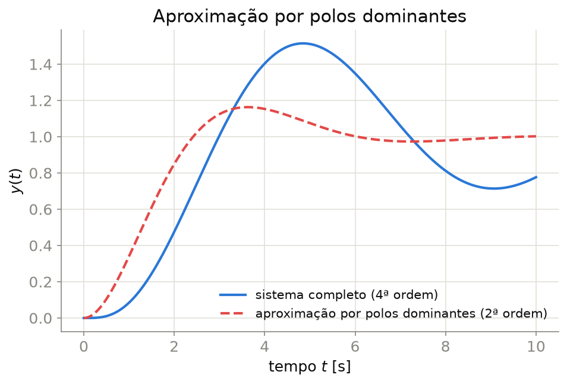
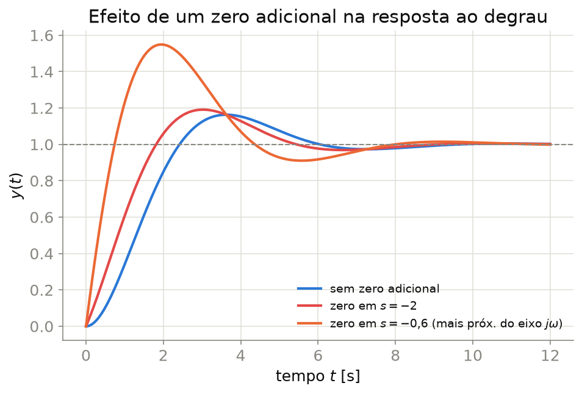
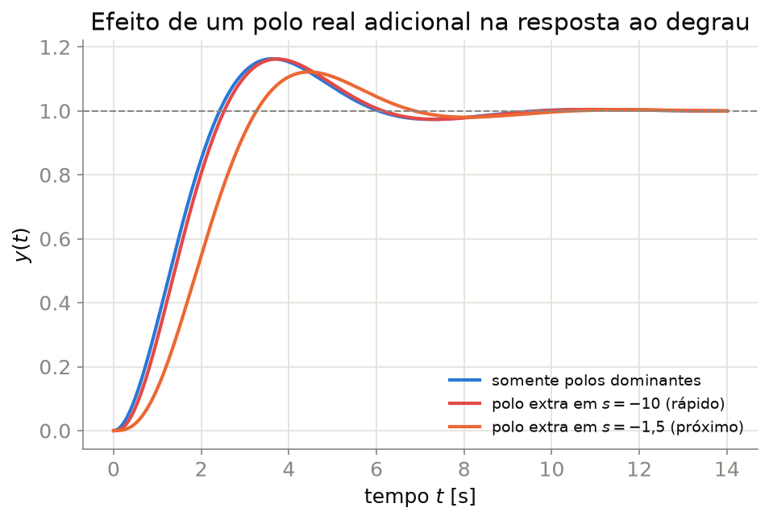

## Sistemas de Ordem Superior

A maioria dos sistemas reais tem **mais de dois polos** (e possivelmente zeros). A resposta ao degrau de um sistema de ordem $n$ com polos distintos é uma soma de modos:

$$y(t) = K + \sum_{i} A_i\,e^{-\sigma_i t} + \sum_{j} B_j\,e^{-\sigma_j t}\cos(\omega_{d,j} t + \phi_j)$$

- Cada polo real contribui um termo exponencial; cada par complexo conjugado, um termo oscilatório amortecido
- As fórmulas de $M_p$, $t_p$, $t_s$ da Aula 4 **não** se aplicam diretamente — mas frequentemente podemos **aproximar** o sistema por um par de polos dominantes

---

## Polos Dominantes

::: {.callout-important}
## Critério de dominância (regra prática)
Um par de polos complexos conjugados é considerado **dominante** se os demais polos têm parte real **pelo menos 5 vezes mais negativa**:

$$\text{Re}(s_{\text{outros}}) \leq 5\times\text{Re}(s_{\text{dominante}})$$
:::

- Modos associados a polos mais à esquerda decaem muito mais rápido ($e^{-\sigma t}$) e contribuem pouco após o transitório inicial
- Se a dominância se verifica, o sistema completo pode ser **aproximado** por um sistema de 2ª ordem equivalente, usando as fórmulas já conhecidas

---

## Aproximação por Polos Dominantes — Exemplo

{width="70%" fig-align="center"}

O sistema de 4ª ordem tem um par de polos dominantes com $\zeta\omega_n \approx 0{,}5$ e dois polos rápidos adicionais — a resposta de 2ª ordem captura bem a forma geral, com pequeno desvio no início.

---

## Cancelamento Polo-Zero

Quando um **zero** está muito próximo de um **polo não-dominante**, seus efeitos se aproximam de um cancelamento mútuo — o resíduo associado àquele modo torna-se pequeno e sua contribuição à resposta é desprezível.

::: {.callout-tip}
Cancelamento (quase) exato de polo-zero é uma técnica de **projeto de controladores** (ex.: controlador PD ou PI cancelando um polo lento da planta) — veremos isso na Aula 9.
:::

::: {.callout-warning}
Cancelamento **nunca é exato** na prática (incerteza de modelo) — polos e zeros próximos, mas não idênticos, ainda geram uma resposta lenta de pequena amplitude ("cauda longa").
:::

---

## Efeito de um Zero Adicional

{width="68%" fig-align="center"}

- Um zero em $s=-a$ (SPE) **aumenta o sobressinal** e **reduz o tempo de subida**
- Quanto mais **próximo do eixo $j\omega$** (menor $a$ em relação a $\zeta\omega_n$), maior o efeito

---

## Zeros de Fase Não-Mínima

Se o zero estiver no **semiplano direito** ($s=+a$, $a>0$), o sistema é dito de **fase não-mínima**:

$$G(s) = \frac{\omega_n^2(1 - s/a)}{s^2+2\zeta\omega_n s+\omega_n^2}$$

- A resposta ao degrau apresenta um **"undershoot"** inicial: a saída parte na direção **oposta** à referência antes de convergir
- Fenômeno comum em: aeronaves (manobra de arfagem), sistemas com atraso de transporte aproximado, alguns processos químicos

::: {.callout-important}
Zeros de fase não-mínima **limitam fundamentalmente** o desempenho alcançável por realimentação — nenhum controlador elimina o undershoot inicial sem violar restrições físicas.
:::

---

## Efeito de um Polo Real Adicional

{width="68%" fig-align="center"}

- Um polo real adicional **sempre reduz o sobressinal** e **aumenta o tempo de subida** (resposta mais lenta)
- Se o polo extra estiver **longe** à esquerda (muito mais rápido que os dominantes), seu efeito é desprezível — validação prática do critério de dominância

---

## Resumo dos Efeitos

| Elemento adicional | Efeito sobre $M_p$ | Efeito sobre $t_r$ | Efeito sobre $t_s$ |
|:--|:--:|:--:|:--:|
| Polo real (SPE), próximo | ↓ reduz | ↑ aumenta | pode aumentar |
| Polo real (SPE), distante | ≈ nulo | ≈ nulo | ≈ nulo |
| Zero real (SPE), próximo | ↑ aumenta | ↓ reduz | pouco efeito |
| Zero real (SPD, fase não-mínima) | *undershoot* inicial | — | pode aumentar |

::: {.callout-tip}
Regra de bolso: **polos atrasam, zeros adiantam** a resposta — e ambos têm mais efeito quanto mais próximos estiverem do eixo imaginário em relação aos polos dominantes.
:::

---

## Exercícios

1. Um sistema tem polos em $s=-1\pm j2$ e $s=-8$. Verifique se o critério de dominância (fator 5) é satisfeito e estime $M_p$ e $t_s$ usando a aproximação de 2ª ordem.
2. Repita o exercício anterior para polos dominantes em $s=-1\pm j2$ e um terceiro polo em $s=-3$. A aproximação ainda é válida? Justifique.
3. Explique, em termos de resíduos da expansão em frações parciais, por que um zero muito próximo de um polo reduz a contribuição do modo associado a esse polo.
4. Descreva um exemplo físico (além de aeronaves) em que um zero de fase não-mínima é relevante, e explique a consequência prática do *undershoot*.
5. Um sistema de 2ª ordem com $\zeta=0{,}5$, $\omega_n=2$ rad/s ganha um zero adicional em $s=-1$. Qualitativamente, como isso altera $M_p$ e $t_r$ em relação ao sistema original?

---

## Referências

::: {#refs}
:::
