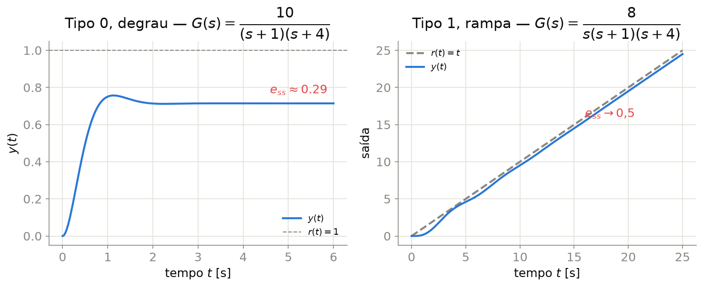

## Erro de Regime Permanente

Para o sistema em malha fechada com realimentação unitária negativa, o **erro atuante** é $e(t) = r(t) - y(t)$. O **erro de regime permanente** é:

$$e_{ss} = \lim_{t\to\infty} e(t) \overset{\text{TVF}}{=} \lim_{s\to 0} s\,E(s)$$

onde o **Teorema do Valor Final (TVF)** só se aplica se $sE(s)$ tiver todos os polos no semiplano esquerdo (sistema em malha fechada estável).

Para a malha com direto $G(s)$ e realimentação unitária:

$$E(s) = R(s) - Y(s) = \frac{R(s)}{1+G(s)}\qquad\implies\qquad e_{ss} = \lim_{s\to0}\frac{s\,R(s)}{1+G(s)}$$

---

## Tipo de Sistema

::: {.callout-important}
## Definição
O **tipo** de um sistema é o número $N$ de polos de $G(s)$ (a função de transferência de malha aberta) na **origem** ($s=0$), isto é, o número de integradores puros em cascata:

$$G(s) = \frac{K\prod_i(s+z_i)}{s^N\prod_j(s+p_j)}, \qquad p_j \neq 0$$
:::

- **Tipo 0**: nenhum integrador — erro finito para degrau, infinito para rampa
- **Tipo 1**: um integrador — erro nulo para degrau, finito para rampa
- **Tipo 2**: dois integradores — erro nulo para degrau e rampa, finito para parábola

::: {.callout-tip}
O tipo depende só de $G(s)H(s)$ (malha aberta), não da malha fechada — mas determina o comportamento em **regime permanente** da malha fechada.
:::

---

## Constantes de Erro Estático

Definidas a partir de $G(s)$ de malha aberta (realimentação unitária):

| Constante | Definição | Entrada associada |
|:--|:--:|:--|
| Posição $K_p$ | $\displaystyle\lim_{s\to0} G(s)$ | degrau $r(t)=A\,u(t)$ |
| Velocidade $K_v$ | $\displaystyle\lim_{s\to0} sG(s)$ | rampa $r(t)=A\,t$ |
| Aceleração $K_a$ | $\displaystyle\lim_{s\to0} s^2G(s)$ | parábola $r(t)=A\,t^2/2$ |

**Erros de regime permanente correspondentes:**

$$e_{ss,\text{degrau}} = \frac{A}{1+K_p}\qquad e_{ss,\text{rampa}} = \frac{A}{K_v}\qquad e_{ss,\text{parábola}} = \frac{A}{K_a}$$

---

## Tabela Erro × Tipo × Entrada

Para entradas de amplitude unitária ($A=1$):

| Tipo | Degrau ($1/s$) | Rampa ($1/s^2$) | Parábola ($1/s^3$) |
|:--:|:--:|:--:|:--:|
| 0 | $\dfrac{1}{1+K_p}$ | $\infty$ | $\infty$ |
| 1 | $0$ | $\dfrac{1}{K_v}$ | $\infty$ |
| 2 | $0$ | $0$ | $\dfrac{1}{K_a}$ |

::: {.callout-important}
Aumentar o tipo do sistema **elimina** o erro para uma classe de entradas, mas cada integrador adicional contribui $-90°$ de fase — tornando o sistema **mais propenso à instabilidade** (Aulas 7 e 8).
:::

---

## Exemplo — Sistema Tipo 0 (Degrau)

$$G(s) = \frac{10}{(s+1)(s+4)} \quad\text{(malha aberta, tipo 0)}$$

$$K_p = \lim_{s\to0}G(s) = \frac{10}{4} = 2{,}5 \qquad\implies\qquad e_{ss} = \frac{1}{1+K_p} = \frac{1}{3{,}5} \approx 0{,}286$$

{width="90%" fig-align="center"}

---

## Exemplo — Sistema Tipo 1 (Rampa)

$$G(s) = \frac{8}{s(s+1)(s+4)} \quad\text{(malha aberta, tipo 1)}$$

$$K_v = \lim_{s\to0}sG(s) = \frac{8}{1\times4} = 2 \qquad\implies\qquad e_{ss} = \frac{1}{K_v} = 0{,}5$$

Note (slide anterior, painel direito): a saída acompanha a rampa com um **atraso constante** de 0,5 unidades — o sistema tipo 1 rastreia rampas com erro finito, mas não nulo.

---

## Por que Aumentar o Ganho Reduz (mas não Elimina) o Erro Tipo 0

Para o sistema tipo 0, $e_{ss}=\dfrac{1}{1+K_p}$ com $K_p \propto K$ (ganho do controlador/planta):

- Aumentar $K$ aumenta $K_p$ e **reduz** $e_{ss}$, mas nunca o zera (assíntota em zero quando $K\to\infty$)
- Aumentar $K$ em excesso **degrada a resposta transitória** (mais sobressinal, possível instabilidade — Aulas 7–8)
- Para **eliminar** o erro ao degrau é necessário aumentar o **tipo** do sistema (adicionar um integrador — ação **integral** do controlador PID, Aula 9)

::: {.callout-tip}
Essa é a principal motivação para a ação **integral** de um controlador PI/PID: adicionar um polo em $s=0$ à malha aberta para eliminar o erro de regime permanente ao degrau.
:::

---

## Erro para Sistemas com Realimentação Não-Unitária

Se a realimentação não é unitária ($H(s)\neq1$, ex.: ganho do sensor), o erro correto é definido sobre o sinal **atuante** $E(s) = R(s) - H(s)Y(s)$, e não simplesmente $R(s)-Y(s)$.

::: {.callout-warning}
Para aplicar diretamente as fórmulas de $K_p$, $K_v$, $K_a$ desta aula, redesenhe o diagrama de blocos com realimentação **unitária equivalente**, movendo $H(s)$ para dentro do ramo direto quando necessário.
:::

---

## Estabilidade: Pré-Requisito para o Erro de Regime Permanente

O TVF e as constantes de erro **só são válidos se a malha fechada for estável** — caso contrário $e(t)$ não converge e "erro de regime permanente" não tem sentido.

::: {.callout-important}
## Critério de Estabilidade (definição)
Um sistema LIT é **estável** (BIBO) se e somente se **todos os polos da malha fechada** estão no **semiplano esquerdo aberto** ($\text{Re}(s) < 0$).
:::

Antes de calcular $e_{ss}$, é preciso **verificar a estabilidade**. Para isso, sem calcular as raízes explicitamente, usamos o **critério de Routh-Hurwitz**.

---

## Critério de Routh-Hurwitz

Dado o polinômio característico $D(s) = a_ns^n + a_{n-1}s^{n-1} + \cdots + a_1 s + a_0$, monta-se o **array de Routh**:

$$
\begin{array}{c|ccccc}
s^n & a_n & a_{n-2} & a_{n-4} & \cdots \\
s^{n-1} & a_{n-1} & a_{n-3} & a_{n-5} & \cdots \\
s^{n-2} & b_1 & b_2 & b_3 & \cdots \\
\vdots & \vdots & & & \\
s^0 & \ast & & &
\end{array}
$$

com $b_1 = \dfrac{a_{n-1}a_{n-2}-a_na_{n-3}}{a_{n-1}}$, $b_2 = \dfrac{a_{n-1}a_{n-4}-a_na_{n-5}}{a_{n-1}}$, e assim por diante, linha a linha.

::: {.callout-important}
## Regra
O número de **raízes no semiplano direito** é igual ao número de **trocas de sinal** na primeira coluna do array. Sistema estável $\iff$ **nenhuma** troca de sinal (todos os elementos da 1ª coluna com o mesmo sinal).
:::

---

## Routh-Hurwitz — Exemplo

**Problema:** verificar a estabilidade de $D(s) = s^3+6s^2+11s+K$ para $K=6$ e depois encontrar a faixa de $K>0$ que mantém o sistema estável.

$$
\begin{array}{c|cc}
s^3 & 1 & 11 \\
s^2 & 6 & K \\
s^1 & \dfrac{6\times11-1\times K}{6} = 11-\dfrac{K}{6} & 0\\
s^0 & K &
\end{array}
$$

**Condições de estabilidade:** todos os termos da 1ª coluna positivos:

$$K > 0 \qquad\text{e}\qquad 11-\frac{K}{6}>0 \implies K<66$$

$$\boxed{0 < K < 66}$$ — para $K=6$, o sistema é estável (dentro da faixa).

---

## Casos Especiais do Array de Routh

- **Zero na primeira coluna** (linha não inteiramente nula): substitui-se o zero por $\epsilon \to 0^+$ e continua-se o array, analisando o sinal quando $\epsilon\to0$.
- **Linha inteiramente nula**: indica polos simétricos em relação à origem (par imaginário puro, ou pares reais simétricos). Forma-se um **polinômio auxiliar** com a linha anterior, deriva-se em $s$, e os coeficientes substituem a linha nula.

::: {.callout-tip}
O caso de **linha nula** é especialmente útil no projeto por LGR (Aula 7): o valor de $K$ que anula uma linha corresponde exatamente ao ganho crítico em que o LGR cruza o eixo $j\omega$.
:::

---

## Exercícios

1. Para $G(s) = \dfrac{20}{(s+2)(s+5)}$ (malha aberta, realimentação unitária), classifique o tipo, calcule $K_p$ e o erro de regime permanente ao degrau unitário.
2. Para $G(s) = \dfrac{K}{s^2(s+3)}$, classifique o tipo e determine o erro para entradas degrau, rampa e parábola unitárias, para qualquer $K>0$.
3. Um sistema tipo 1 deve ter $e_{ss}\leq0{,}05$ para uma rampa de inclinação 2. Determine o valor mínimo de $K_v$ necessário.
4. Monte o array de Routh para $D(s)=s^4+2s^3+3s^2+4s+5$ e determine quantos polos estão no semiplano direito.
5. Para $D(s) = s^3+2s^2+s+K$, use Routh-Hurwitz para encontrar a faixa de $K>0$ que garante estabilidade.

---

## Referências

::: {#refs}
:::
