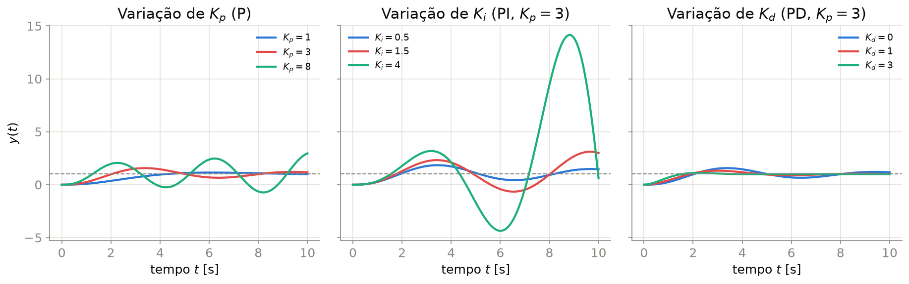
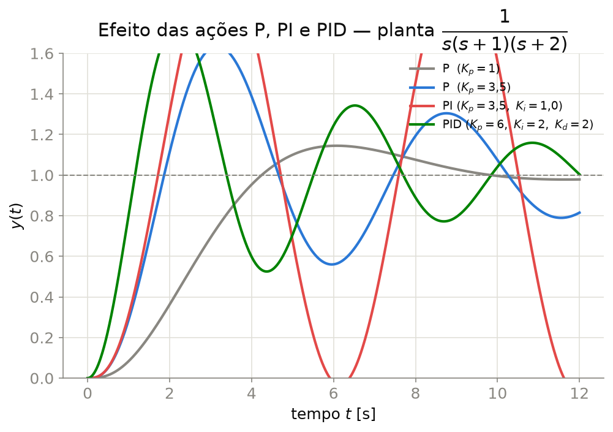

## O Controlador PID

O controlador **Proporcional-Integral-Derivativo (PID)** é, de longe, o mais usado na indústria — estima-se que mais de 90% das malhas de controle industriais usem alguma variante de PID.

$$u(t) = K_p\,e(t) + K_i\int_0^t e(\tau)\,d\tau + K_d\,\frac{de(t)}{dt}$$

$$C(s) = \frac{U(s)}{E(s)} = K_p + \frac{K_i}{s} + K_d s = K_d\,\frac{s^2 + \frac{K_p}{K_d}s + \frac{K_i}{K_d}}{s}$$

::: {.callout-tip}
O PID adiciona **dois zeros** e **um polo na origem** à malha aberta — o polo na origem aumenta o tipo do sistema (elimina erro de regime permanente ao degrau, Aula 6); os zeros dão liberdade para formar o LGR (Aula 7) e ajustar as margens de fase (Aula 8).
:::

---

## Estrutura em Diagrama de Blocos

```{tikz}
%| echo: false
%| fig-align: center
%| fig-width: 14
\usetikzlibrary{arrows.meta, positioning, calc, fit}
\input{imgs/tikz/PIDBloco.tikz}
```

---

## Ação Proporcional (P)

$$C(s) = K_p \qquad\qquad u(t) = K_p\,e(t)$$

- Ação **instantânea**, proporcional ao erro atual
- Aumentar $K_p$: reduz o erro de regime permanente (Aula 6, $K_p^{\text{erro}}\propto K_p$), acelera a resposta, mas **aumenta o sobressinal** e pode levar à instabilidade
- **Não elimina** erro de regime permanente em sistemas tipo 0 (apenas reduz)

::: {.callout-warning}
Ganho proporcional muito alto pode levar o sistema à instabilidade — veja o LGR (Aula 7): aumentar $K_p$ move os polos ao longo do lugar geométrico, podendo cruzar para o semiplano direito.
:::

---

## Ação Integral (I)

$$C(s) = \frac{K_i}{s} \qquad\qquad u(t) = K_i\int_0^t e(\tau)\,d\tau$$

- Acumula o erro ao longo do tempo — mesmo um erro **pequeno** e persistente gera ação de controle crescente
- Adiciona um **polo na origem**: aumenta o tipo do sistema em 1 $\implies$ **elimina** o erro de regime permanente ao degrau (sistemas tipo 0 → tipo 1)
- **Custo:** adiciona $-90°$ de fase, reduzindo a margem de fase (Aula 8) e tornando a resposta mais lenta/oscilatória se $K_i$ for muito grande

::: {.callout-important}
## Windup integral
Se o atuador saturar (limite físico de $u(t)$), o termo integral pode continuar acumulando erro indefinidamente, causando grande sobressinal ao sair da saturação. Controladores reais implementam **anti-windup** (ex.: parar a integração quando saturado).
:::

---

## Ação Derivativa (D)

$$C(s) = K_d\,s \qquad\qquad u(t) = K_d\,\frac{de(t)}{dt}$$

- Reage à **taxa de variação** do erro — antecipa a tendência, "freando" a resposta antes de atingir o valor final
- Adiciona um **zero**: tende a **reduzir o sobressinal** e melhorar a margem de fase (fase adicional de $+90°$), permitindo aumentar $K_p$ com mais segurança
- **Nunca usado sozinho** (ação D pura não atua sobre erro constante) — sempre combinado com P ou PI

::: {.callout-warning}
## Chute derivativo e ruído
A derivada amplifica **ruído de alta frequência** — na prática, usa-se um **filtro passa-baixas** na ação derivativa, e a derivada é aplicada sobre a **saída medida** $y(t)$ (não sobre o erro) para evitar o *"derivative kick"* causado por mudanças bruscas na referência.
:::

---

## Efeito Individual dos Ganhos

{width="95%" fig-align="center"}

---

## Tabela-Resumo: Efeito Qualitativo dos Ganhos

| Aumentar | Tempo de subida | Sobressinal | Tempo de acomodação | Erro regime perm. (degrau) |
|:--|:--:|:--:|:--:|:--:|
| $K_p$ | ↓ diminui | ↑ aumenta | pouco efeito | ↓ diminui (não elimina) |
| $K_i$ | ↓ diminui | ↑ aumenta | ↑ aumenta | elimina |
| $K_d$ | pouco efeito | ↓ diminui | ↓ diminui | pouco efeito |

::: {.callout-warning}
Esta tabela (clássica em Ogata/Nise) descreve **tendências isoladas** — os três ganhos interagem, e o ajuste fino deve sempre ser validado por simulação ou teste no processo real.
:::

---

## Comparação P, PI, PID em Malha Fechada

{width="70%" fig-align="center"}

Planta $G(s)=\dfrac{1}{s(s+1)(s+2)}$ (tipo 1): note que **P** e **PID** eliminam o erro (a planta já é tipo 1); a ação **integral** do PI eleva o tipo para 2, e a ação **derivativa** do PID amortece o sobressinal introduzido pelo integrador.

---

## Sintonia de Ziegler-Nichols — Método da Malha Fechada

Método experimental clássico [@ziegler1942], aplicável quando não se dispõe de um modelo preciso da planta:

1. Com controlador **apenas proporcional** ($K_i=K_d=0$), aumente $K_p$ até que a saída apresente **oscilação sustentada** (amplitude constante) — esse é o **ganho crítico** $K_{cr}$ (relaciona-se ao $K_{crít}$ do cruzamento do LGR com o eixo $j\omega$, Aula 7)
2. Meça o **período crítico** $T_{cr}$ da oscilação sustentada

| Controlador | $K_p$ | $T_i$ | $T_d$ |
|:--|:--:|:--:|:--:|
| P | $0{,}5\,K_{cr}$ | — | — |
| PI | $0{,}45\,K_{cr}$ | $T_{cr}/1{,}2$ | — |
| PID | $0{,}6\,K_{cr}$ | $T_{cr}/2$ | $T_{cr}/8$ |

com $K_i = K_p/T_i$ e $K_d = K_p T_d$.

---

## Sintonia de Ziegler-Nichols — Método da Curva de Reação

Alternativa **sem** levar o sistema à instabilidade — aplica-se um degrau em malha **aberta** e mede-se a curva de reação da planta (assumida aproximável por um modelo de 1ª ordem com atraso, FOPDT):

$$G(s) \approx \frac{K}{\tau s + 1}\,e^{-Ls}$$

obtendo-se o ganho $K$, a constante de tempo $\tau$ e o atraso $L$ diretamente da curva:

| Controlador | $K_p$ | $T_i$ | $T_d$ |
|:--|:--:|:--:|:--:|
| P | $\tau/L$ | — | — |
| PI | $0{,}9\,\tau/L$ | $L/0{,}3$ | — |
| PID | $1{,}2\,\tau/L$ | $2L$ | $0{,}5L$ |

::: {.callout-tip}
As regras de Ziegler-Nichols fornecem um **ponto de partida razoável**, não um projeto ótimo — costuma-se refinar manualmente após a sintonia inicial (reduzir $K_p$ se houver sobressinal excessivo, etc.).
:::

---

## Estruturas Derivadas: PI e PD

::: {.columns}
::: {.column width="50%"}

**PI** — quando a resposta rápida da ação D não é necessária, ou o ruído de medição é elevado:

$$C(s) = K_p\left(1+\frac{1}{T_i s}\right)$$

- Elimina erro de regime permanente
- Adequado para plantas já razoavelmente amortecidas

:::
::: {.column width="50%"}

**PD** — quando não há erro de regime permanente a eliminar (ou ele é tolerável), priorizando resposta rápida com baixo sobressinal:

$$C(s) = K_p(1+T_d s)$$

- Melhora a margem de fase e a resposta transitória
- Não afeta o tipo do sistema

:::
:::

---

## Boas Práticas de Implementação

- **Anti-windup**: limitar ou "congelar" a integração quando o atuador satura
- **Derivada filtrada**: aplicar a ação D sobre $y(t)$ filtrado (passa-baixas) para atenuar ruído
- **Derivada sobre a saída, não sobre o erro**: evita o *"derivative kick"* em mudanças bruscas de referência
- **Discretização**: implementações reais são digitais — a integral vira um somatório e a derivada uma diferença finita (tema de Sistemas de Controle II)

---

## Exercícios

1. Para uma planta $G(s)=\dfrac{1}{(s+1)(s+3)}$ controlada com PI, mostre que o tipo do sistema em malha aberta passa de 0 para 1 e que, portanto, o erro ao degrau é eliminado em malha fechada.
2. Um teste de malha fechada com controlador P puro apresentou oscilação sustentada para $K_p=K_{cr}=10$, com período $T_{cr}=2$ s. Calcule os parâmetros de um controlador PID pelo método de Ziegler-Nichols (malha fechada).
3. Explique por que a ação derivativa pura ($C(s)=K_ds$) nunca é usada isoladamente em um controlador.
4. Descreva o fenômeno de *windup* integral e proponha (em palavras) uma estratégia de anti-windup para um atuador com saturação em $\pm10$ V.
5. Compare, para a planta $G(s)=1/[s(s+1)(s+2)]$ (Aula 9, exemplo de comparação), o motivo pelo qual o controlador PI apresenta mais oscilação do que o P puro, relacionando com a fase adicional introduzida pelo integrador (Aula 8).

---

## Referências

::: {#refs}
:::
